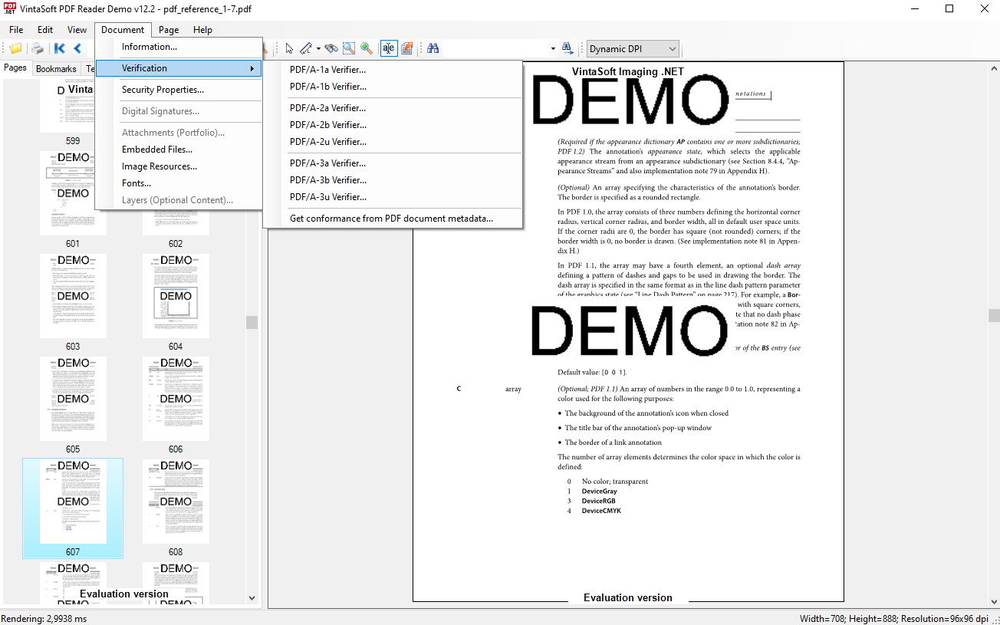

# VintaSoft WinForms PDF Reader Demo

This C# project uses <a href="https://www.vintasoft.com/vsimaging-dotnet-index.html">VintaSoft Imaging .NET SDK</a> and demonstrates how to view PDF document in WinForms:
* Load PDF document.
* Display and print PDF document with or without color management.
* View general information about PDF document.
* View permission settings of PDF document.
* View digital signatures of PDF document.
* Verify PDF document to conformance with PDF/A-1a, PDF/A-1b, PDF/A-2a, PDF/A-2b, PDF/A-3a, PDF/A-3b, PDF/A-4, PDF/A-4e or PDF/A-4f specification.
* Navigate PDF document.
* Execute JavaScript actions of PDF document.
* Save PDF page to any supported image file format.
* Extract text and images from PDF page.
* View information about embedded files, image resources or fonts of PDF document.
* Save embedded files or image resources to a file.


## Screenshot



## Usage
1. Get the 30 day free evaluation license for <a href="https://www.vintasoft.com/vsimaging-dotnet-index.html" target="_blank">VintaSoft Imaging .NET SDK</a> as described here: <a href="https://www.vintasoft.com/docs/vsimaging-dotnet/Licensing-Evaluation.html" target="_blank">https://www.vintasoft.com/docs/vsimaging-dotnet/Licensing-Evaluation.html</a>

2. Update the evaluation license in "CSharp\MainForm.cs" file:
   ```
   Vintasoft.Imaging.ImagingGlobalSettings.Register("REG_USER", "REG_EMAIL", "EXPIRATION_DATE", "REG_CODE");
   ```

3. Build the project ("PdfReaderDemo.Net10.csproj" file) in Visual Studio or using .NET CLI:
   ```
   dotnet build PdfReaderDemo.Net10.csproj
   ```

4. Run compiled application and try to view PDF document.


## Documentation
VintaSoft Imaging .NET SDK on-line User Guide and API Reference for .NET developer is available here: https://www.vintasoft.com/docs/vsimaging-dotnet/


## Support
Please visit our <a href="https://myaccount.vintasoft.com/">online support center</a> if you have any question or problem.
